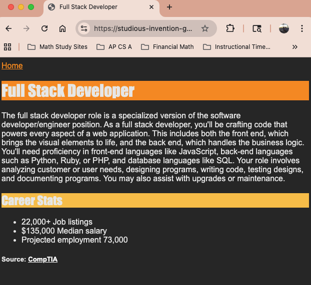

# css-multipage

## Learning Target
- I am learning how to create websites with multiple pages

## Success Criteria
- I can create other ```.html``` pages and link to them using ```<a>``` tags
- I can create a ```styles.css``` file and link it to html files using ```<link rel="stylesheet" href="style.css">``` in the ```<head>``` section
- I can use one ```styles.css``` file to style multiple pages


## Directions
1. Install Live Server and Go Live
2. Add an ```index.html``` file and use the ```!``` shortcut to add the required html tags
3. Follow the steps below and my example to complete the assignment

## Assignment
You are going to research careers in the tech industry and create a small website with information about **two** specific career in tech.

### Step 1: Research
1. Navigate to [CompTIA Tech Careers](https://www.comptia.org/en-us/explore-careers/job-roles/?page=1&category=all)
2. Explore the different tech careers and pick **two** that you will use for this assignment

### Step 3: Create the main page
1. In your ```index.html``` set the ```<title>``` to *Tech Careers*
2. Add an ```<h1>``` with the text *Tech Careers*
3. Add an ```<h2>``` with the name of the first career you picked e.g. *Full Stack Developer*
4. Add a ```<p>``` and copy over the summary from the CompTIA website
5. Repeat steps 3 and 4 for your second career

### Step 4: Create a career details page
1. Create a new file named ```jobinfo1.html``` and use the ```!``` shortcut to add the required html tags
2. Add ```/job1info.html``` to the *address bar* of your page preview to open the new page. It should look something like this: ***studious-invention-g76xqvx4wp4c9v45.github.dev/job1info.html***
2. Set the ```<title>``` to the name of your first career e.g. *Full Stack Developer*
3. Add an ```<h1>``` with the name of your first career (same as title)
4. Add a ```<p>``` tag and copy over the more detailed description of the career from CompTIA (under Overview)
5. Add an ```<h2>``` that says *Career Stats*
6. Using an ```<ul>``` and ```<li>``` tags, create a list to show the number of job listingings, median salary, and projected employment using the information from CompTIA
7. Add an ```<h5>``` tag that says *Source: CompTIA*
8. Add an ```<a>``` tag around *CompTIA* and set the ```href``` attribute so that it links to the CompTIA page about the career

### Step 5: Link the pages together
1. Switch back to edit ```index.html```
2. Underneath the ```<p>``` tag for your first career, use an ```<a>``` tag to link to your ```job1info.html``` file with the display text *More info*
3. Test that the link works to open ```job1info.html```
4. Edit ```job1info.html``` and add an ```<a>``` tag above the ```<h1>``` that says *Home* and links to ```index.html```

### Step 6: Create a second career details page
Repeat steps 4 and 5 for your second career

### Step 7: Add some styles
1. Create a new file named ```styles.css```
2. Link the ```styles.css``` to each of your html docs by adding ```<link rel="stylesheet" href="styles.css">``` to the ```<head>``` section of each of your html files
3. Add the following styles
    - body: dark background color, light text color, and font-family Arial
    - h1: font-family Impact, background color
    - h2: font-family Impact, different bg color
    - a: light text color
    - Color and background color for *More info* links (**Hint** use the **class** ```more-info``` on only those links)
    - Color and background color for *Home* links (**Hint** use the **id** ```home``` on only those links)

### Example finished index.html
 

### Example finished job1info.html
